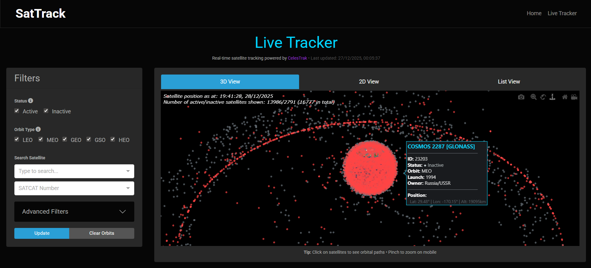
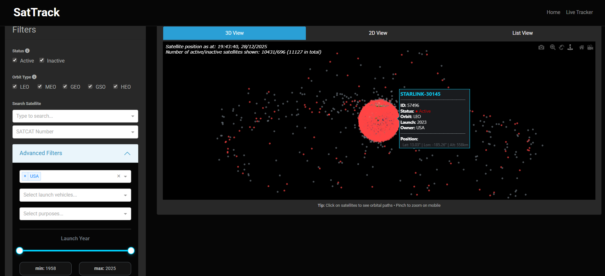
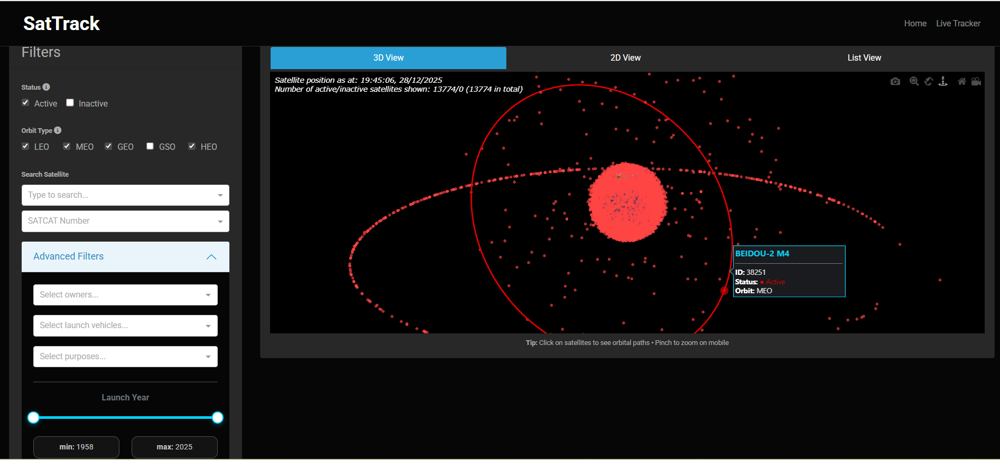
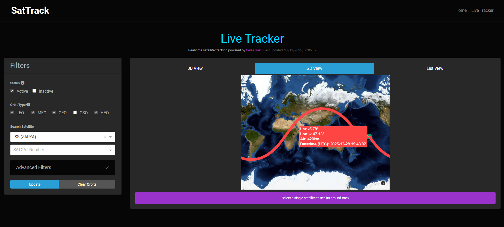

# SatTrack

**Version:** 2.0.1

## Description

This repository contains python scripts to run the SatTrack App - an open-source real-time satellite tracking app - for visualising active and inactive satellites orbiting the Earth. The latest version of the app is hosted at [https://sattrackapp.herokuapp.com/](https://sattrackapp.herokuapp.com/).

The project consists of two parts - (1) data pipeline; (2) interactive app. In the data pipeline, satellite catalogue and TLE data is pulled from CelesTrak, UCS (Union of Concerned Scientists) and space.skyrocket via web scrapers and API calls into a SQLite database. The interactive app is a Dash app (which can be hosted on Heroku) in which satellite TLE data is converted into a real-time satellite position and satellite catalogue data is used to filter 2d and 3d visualisations. The app also allows satellite position data to be exported in tabular form (to a csv).

## Pipeline/App Features

- Checks CelesTrak and UCS webpages for most recent update
- Downloads satellite catalogue and TLE data from CelesTrak website
- Downloads satellite catalogue data from UCS website
- 3D visualisation of (current) active/inactive satellite positions
- 3D visualisation of satellite orbital path
- 2D real-time satellite tracker (shows latitude, longitude and altitude)
- Tabular export (to csv) of satellite details and position
- TODO:
  - Automate pipeline with airflow

## Requirements

### Python Version
- Python 3.12 or higher

### Dependencies
Key dependencies (see [pyproject.toml](pyproject.toml) for full list):
- Dash 2.12.1
- Plotly 5.7.0
- Dash Bootstrap Components 1.1.0
- Astropy 5.0.4
- NumPy 1.22.3
- Pandas 1.4.2
- SGP4 2.21

## Installation

This project uses [Poetry](https://python-poetry.org/) for dependency management.

### Option 1: Using Poetry (Recommended)

1. Clone the repository:
   ```bash
   git clone <repository-url>
   cd SatTrack
   ```

2. Install Poetry if you haven't already:
   ```bash
   pip install poetry
   ```

3. Install dependencies using Poetry:
   ```bash
   poetry install
   ```
   This will create a virtual environment and install all dependencies specified in `pyproject.toml`.

4. Activate the Poetry shell:
   ```bash
   poetry shell
   ```

### Option 2: Using pip (Legacy)

1. Clone the repository:
   ```bash
   git clone <repository-url>
   cd SatTrack
   ```

2. Create and activate a virtual environment with Python 3.12:
   ```bash
   py -3.12 -m venv venv
   source venv/Scripts/activate  # On Windows Git Bash
   # or
   venv\Scripts\activate  # On Windows CMD
   ```

3. Install required packages:
   ```bash
   pip install -r requirements.txt
   ``` 

## Dependency Management

This project uses Poetry for dependency management. The `requirements.txt` file is automatically generated from `pyproject.toml` for Heroku deployment compatibility.

### Updating Dependencies

When you add, update, or remove dependencies in `pyproject.toml`:

#### Option 1: Automatic Sync (Recommended)
Simply push your changes to GitHub. The GitHub Action workflow will automatically:
- Install dependencies
- Update `requirements.txt`
- Commit the changes to your PR

**No manual action required!**

#### Option 2: Manual Sync (Local Convenience)
For immediate local verification before pushing:

```bash
# Run the sync script
./sync_dependencies.sh
```

This script will:
1. Install dependencies with Poetry
2. Update `requirements.txt`
3. Show you what changed
4. Provide next steps

**Manual update (if you prefer one-liners):**
```bash
poetry install && poetry export -f requirements.txt --output requirements_temp.txt --without-hashes --without dev && python -c "import re; content = open('requirements_temp.txt').read(); open('requirements.txt', 'w').write(re.sub(r' ;.*', '', content))" && rm requirements_temp.txt
```

## Run Pipeline

Run the data pipeline to extract, clean and dump satellite catalogue and TLE data:

**Using Poetry:**
```bash
poetry run python run_pipeline.py
```

**Using pip:**
```bash
python run_pipeline.py
```

## Run App

**Using Poetry:**
```bash
poetry run python run_app.py
```

**Using pip:**
```bash
python run_app.py
```

The app will be available at http://127.0.0.1:8050/

## Testing Heroku Deployment

Before deploying to Heroku, test your app locally to ensure it works with the production environment.

### Local Testing on Windows

**Note:** Gunicorn (Heroku's production server) doesn't work on Windows because it requires Unix-specific modules. Use one of these alternatives:

#### Option 1: Test with Development Server (Current Method)
```bash
python run_app.py
```
Visit http://127.0.0.1:8050/ - If this works, your app should work on Heroku.

#### Option 2: Use Waitress (Windows-Compatible Production Server)
```bash
# Install waitress
pip install waitress

# Run with waitress (production-quality server that works on Windows)
waitress-serve --listen=*:8000 run_app:server
```
Visit http://localhost:8000 to test.

#### Option 3: Deploy to Heroku Staging App (Most Accurate)
```bash
# Create a staging app
heroku create sattrack-staging

# Deploy your branch
git push heroku your-branch:main

# Check logs
heroku logs --tail --app sattrack-staging

# Open the app
heroku open --app sattrack-staging
```

### Local Testing on Linux/Mac

If you're on Linux or Mac, you can test with gunicorn directly:

```bash
# Install dependencies
pip install -r requirements.txt

# Test with gunicorn (same as Heroku)
gunicorn run_app:server
```
Visit http://localhost:8000 to verify.

### Pre-Deployment Checklist

Before deploying, verify:
- ✅ App runs locally with Python 3.12 (`python --version`)
- ✅ All dependencies install from `requirements.txt`
- ✅ `runtime.txt` specifies `python-3.12`
- ✅ `Procfile` contains `web: gunicorn run_app:server`
- ✅ No errors in the app functionality

## Version History

See [CHANGELOG.md](CHANGELOG.md) for detailed version history and release notes.

### Current Version: 2.0.1

#### Latest Updates (2.0.1)
- Fixed Heroku deployment issue with Poetry
- Configured for Python 3.12 compatibility

#### Key Features (2.0.0)
- Upgraded to Python 3.12
- Modern dependency management with Poetry
- Automated requirements.txt synchronization
- Real-time satellite position tracking using TLE data
- 3D visualisation of active and inactive satellites
- 2D visualisation of satellite path
- Interactive filters and mobile-optimized interface
- CSV export functionality

#### Planned Improvements (Future Versions)
- Satellite pass predictor visualisation
- Satellite pass predictor export
- Enhanced logging for data pipeline
- Satellite informational page
- S3 migration
- DuckDB migration
- Airflow automation

## Versioning

This project follows [Semantic Versioning](https://semver.org/):
- **MAJOR** version (`major/` prefix) for incompatible API changes (breaking changes)
- **MINOR** version (`feature/` prefix) for new functionality in a backward-compatible manner
- **PATCH** version (`fix/` prefix) for backward-compatible bug fixes

### PR Naming Convention

Pull requests should be prefixed with the change type:
- `major/` - Breaking changes (e.g., `major/python-version-update`)
- `feature/` - New features (e.g., `feature/satellite-pass-predictor`)
- `fix/` - Bug fixes (e.g., `fix/csv-export-encoding`)
- `docs/` - Documentation updates
- `refactor/` - Code refactoring
- `test/` - Test additions/updates
- `chore/` - Maintenance tasks

See [CHANGELOG.md](CHANGELOG.md) for detailed version history.

## Contributors

**Developer:** Francis Nwobu


## Visualisations

- Screenshots taken from app:









