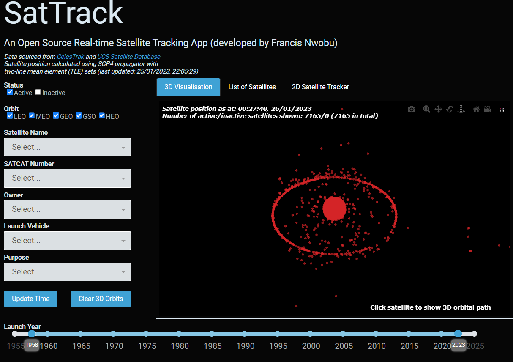
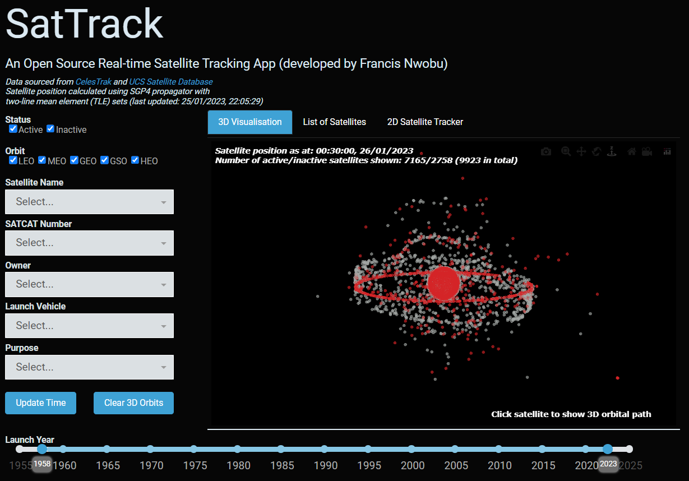

# SatTrack

## Description

This repository contains python scripts to run the SatTrack App - an open-source real-time satellite tracking app - for visualising active and inactive satellites orbiting the Earth. Latest version of the app is hosted at [https://sattrackapp.herokuapp.com/](https://sattrackapp.herokuapp.com/).

The project consists of two parts - (1) data pipeline; (2) interactive app. In the data pipeline, satellite catalogue and TLE data is pulled from CelesTrak, UCS (Union of Concerned Scientists) and space.skyrocket via web scrapers and API calls into a SQLite database. The interactive app is a Dash app (which can be hosted on Heroku) in which satellite TLE data is converted into a real-time satellite position and satellite catalogue data is used to filter 2d and 3d visualisations. The app also allows satellite position data to be exported in tabular form (to a csv).

## Pipeline/App Features

- Checks CelesTrak and UCS webpages for most recent update
- Downloads satellite catalogue and TLE data from CelesTrak website
- Downloads satellite catalogue data from UCS website
- 3D visualisation of (current) active/inactive satellite positions
- 3D visualisation of satellite orbital path
- 2D real-time satellite tracker (shows latitude, longitude and altitude)
- Tabular export (to csv) of satellite details and position
- TODO:
  - Automate pipeline with airflow
  - Slider to manually select time to compute satellite position 

## Installation

- Requires Python 3.8
- Required Python packages can be found in requirements.txt 

## Run Pipeline

- Run `python run_pipeline_manual.py` script - calls wrapper functions to extract, clean and dump satellite catalogue and TLE data

## Run App

- To run app on local server, run `python app_dev.py` 
- To run app on production server (e.g. Heroku), run `python app.py`(see 

## Contributors

Developer: Francis Nwobu

## Examples

- Screenshots taken from app:

<!--  -->
